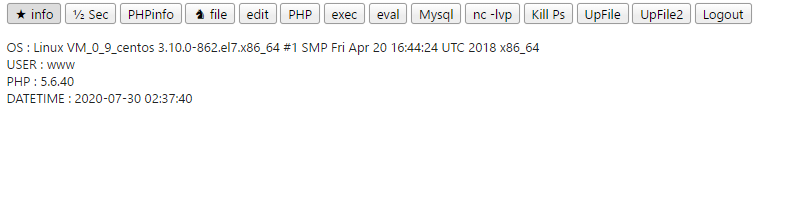

# Copy-PHPWebShell

<h5>更新历史</h5>
[ ]2020-7-22 14:30 Update Bypass Ddun  
[ ]2020-7-29 17:40 修复文件管理功能需刷新显示Bug  
[ ]2020-7-29 18:17 修复文件写入失败404 Bug  

<h5>已知问题:</h5>
文件管理中无法正确跳转编辑文件 无法在文件管理中修改目录下文件

<h5>graph</h5>

___

/* 
 * PHP WEBSHELL
 *
 * Features:
 *		[0] &#9733; info #基础信息
 *		[1] &frac12; Sec # disable_functions 速查
 *		[2] PHPinfo
 *		[3] &#9822; file #文件管理
 *		[4] edit #编辑文件
 *		[5] PHP
 *		[6] exec # CMD 命令执行终端
 *		[7] eval
 *		[8] Mysql
 *		[9] nc -lvp #Nc 转发
 *		[10] Kill Ps #依据PID或进程名称结束进程
 *		[11] UpFile #写入文件
 *		[12] UpFile2 #上传文件
 *		[13] Logout #退出登录
 *
 * Account:
 *		[Password] admin
 */
